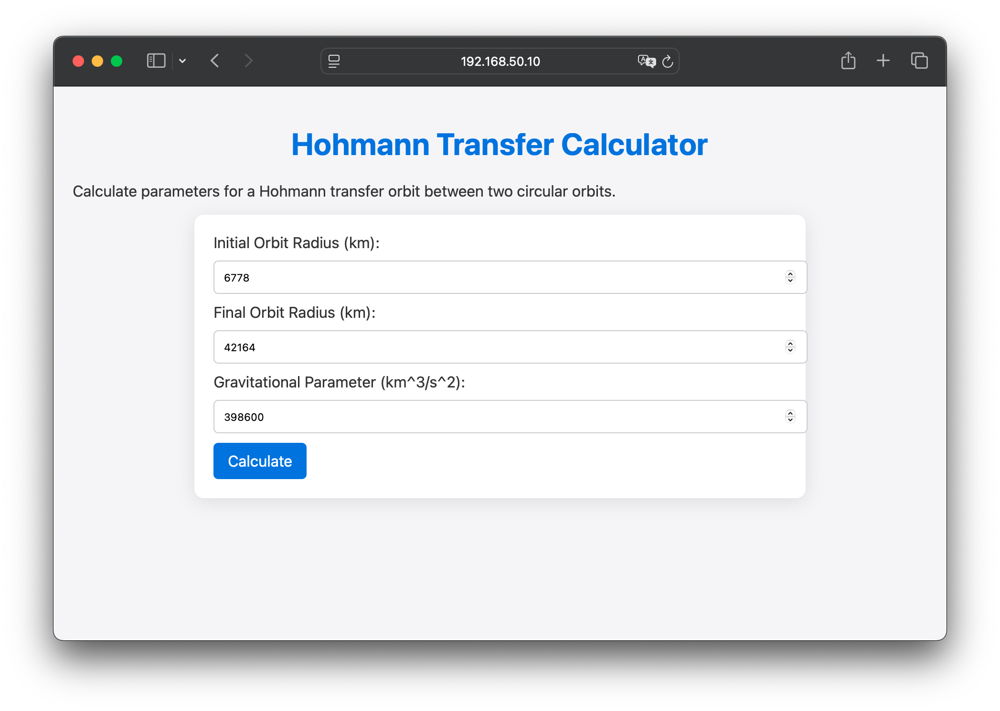
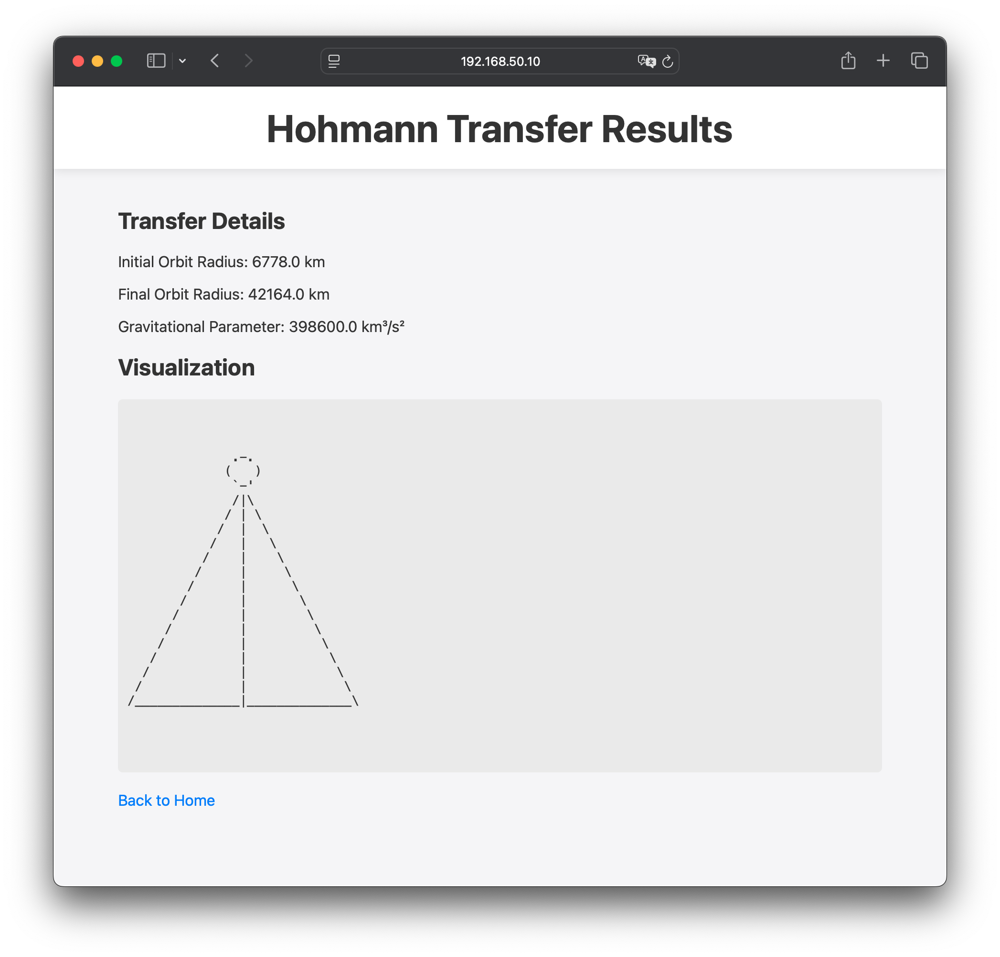

# VibeKit

A dynamic, intent-driven Python library that interprets and executes functions based on your needs.

[](https://opensource.org/licenses/MIT)
[](https://pypi.org/project/vibekit/)

## 📋 Overview

VibeKit is an innovative Python library that breaks the traditional programming paradigm. Instead of being constrained by predefined methods, VibeKit interprets your function calls dynamically, allowing you to express your intent through natural function names and parameters. This creates a flexible, intuitive development experience where the library adapts to your needs.

VibeKit uses Large Language Models (OpenAI or Anthropic) behind the scenes to understand and execute your function calls. Simply provide your API key, and VibeKit will handle the rest.

## ✨ Key Features

- **Dynamic Function Interpretation** - Call any function you can imagine, and VibeKit will interpret your intent
- **Asynchronous Support** - Built with full support for `async`/`await` for non-blocking operations
- **Intuitive API** - Natural programming interface that adapts to your thinking process
- **LLM Integration** - Seamless integration with OpenAI (GPT-4) and Anthropic (Claude) models
- **Zero Configuration** - Get started with minimal setup
- **Extensible Architecture** - Easily add custom functionality to meet your specific needs

## 🚀 Installation

```bash
# Using pip
pip install vibekit

# Using poetry
poetry add vibekit
```

## 🔧 Quick Start

Initialize the client, connect to the service, and start using dynamic functions:

```python
from vibekit import VibeKitClient

# Initialize with your API key (OpenAI or Anthropic)
client = VibeKitClient(
    api_key="your_api_key",  # Required: OpenAI or Anthropic API key
)

# Connect to the service
await client.connect()

# Use any function name that expresses your intent
sum_result = await client.calculate_sum(5, 10)
print(sum_result)  # Output: 15

# VibeKit interprets your intent from function names and parameters
weather = await client.get_weather_for("New York")
print(weather)  # Output: Weather data for New York
```

## 📖 Usage Examples

### Mathematical Operations

```python
# Addition
sum_result = await client.add(5, 3)
# or
sum_result = await client.calculate_sum(5, 3)

# Complex calculations
result = await client.calculate_compound_interest(1000, 0.05, 5)
```

### Data Processing

```python
# Filter a list
filtered_data = await client.filter_by_property(users, "age", "> 30")

# Sort collection
sorted_items = await client.sort_by_price(products, "ascending")
```

### API Interactions

```python
# Fetch data
user_data = await client.fetch_user_profile("user123")

# Send data
response = await client.submit_form({
    "name": "John Doe",
    "email": "john@example.com",
})
```

## 🛠️ Advanced Configuration

```python
client = VibeKitClient(
    api_key="your_api_key",
    timeout=5.0,  # Request timeout in seconds
    retries=3,  # Number of retry attempts
    debug=True,  # Enable debug logging
)

# You can also update configuration after initialization
client.set_config({
    "timeout": 10.0,
    "retries": 5
})
```

## 📚 API Documentation

### Core Methods

- `client.connect()` - Initializes the library and establishes connections to the LLM service
- `client.disconnect()` - Cleans up resources
- `client.set_config(options)` - Updates client configuration
- `client.get_status()` - Returns the current connection status and provider information

### Dynamic Functions

VibeKit's core philosophy allows you to call any function by name. The library interprets your intent based on:

- The function name (e.g., `calculate_tax`, `fetch_user_data`)
- The parameters provided
- The context of your application

Under the hood, VibeKit translates your function call into a natural language description and uses GPT-4o or Claude to interpret and execute it.

## 🚀 Advanced Examples

### The Ridiculous Frontier: Orbital Mechanics Calculator

Want to see how far VibeKit can go? Here's an example that demonstrates the absurd power of dynamic function generation - generating an entire web application for orbital mechanics calculations with just a few lines of code.

In this example, VibeKit handles both the complex math of Hohmann transfer orbits AND generates a complete styled web interface on the fly:



```python
# Generate a complete HTML page with Hohmann transfer calculation results
response = await client.generate_hohmann_transfer_results_page_html(
    style="Make it look like the Apple homepage",
    initial_orbit_radius=initial_orbit_radius,
    final_orbit_radius=final_orbit_radius,
    gravitational_parameter=gravitational_parameter,
    include_visualization=True,
    visualization_style="ASCII ART STYLE",
    back_link_url="/"
)
```

This function doesn't actually exist in the codebase - VibeKit interprets this request dynamically, using AI to:
1. Understand what a Hohmann transfer is
2. Perform the complex orbital mechanics calculations
3. Generate a complete, styled HTML page with results
4. Create visualizations of the transfer orbit

No HTML, CSS, JavaScript, or orbital mechanics knowledge required!



### The Complete Flask Example

Here's how the entire Flask route is implemented:

```python
@app.route('/calculate', methods=['POST'])
def calculate():
    """Handle form submission and return results."""
    # Get form data
    initial_orbit_radius = float(request.form.get('initial_orbit_radius', 6778))
    final_orbit_radius = float(request.form.get('final_orbit_radius', 42164))
    gravitational_parameter = float(request.form.get('gravitational_parameter', 398600))
    
    # Let VibeKit handle both the calculation and result display
    async def get_results():
        response = await client.generate_hohmann_transfer_results_page_html(
            style="Make it look like the Apple homepage",
            initial_orbit_radius=initial_orbit_radius,
            final_orbit_radius=final_orbit_radius,
            gravitational_parameter=gravitational_parameter,
            include_visualization=True,
            visualization_style="ASCII ART STYLE",
            back_link_url="/"
        )
        return response["html"] if isinstance(response, dict) and "html" in response else response
    
    result = loop.run_until_complete(get_results())
    return result
```

## What the Hell?

Is this satire? Yes, kind of. It's obviously horribly inefficient and not how you'd build a production system. At the same time, if you're prototyping something quickly and want to outsource one part of the development process temporarily, it's not actually a horrible idea.

## 🤝 Contributing

Contributions are welcome! Please feel free to submit a Pull Request.

1. Fork the repository
2. Create your feature branch (`git checkout -b feature/amazing-feature`)
3. Commit your changes (`git commit -m 'Add some amazing feature'`)
4. Push to the branch (`git push origin feature/amazing-feature`)
5. Open a Pull Request

## 📄 License

This project is licensed under the MIT License - see the LICENSE file for details.

## 🙏 Acknowledgements

- Special thanks to Klemen who posted this in Slack at work one day and didn't realize that the best jokes are the ones taken too far.

---

<p align="center">
  Built with ❤️ by the VibeKit Team
</p>

